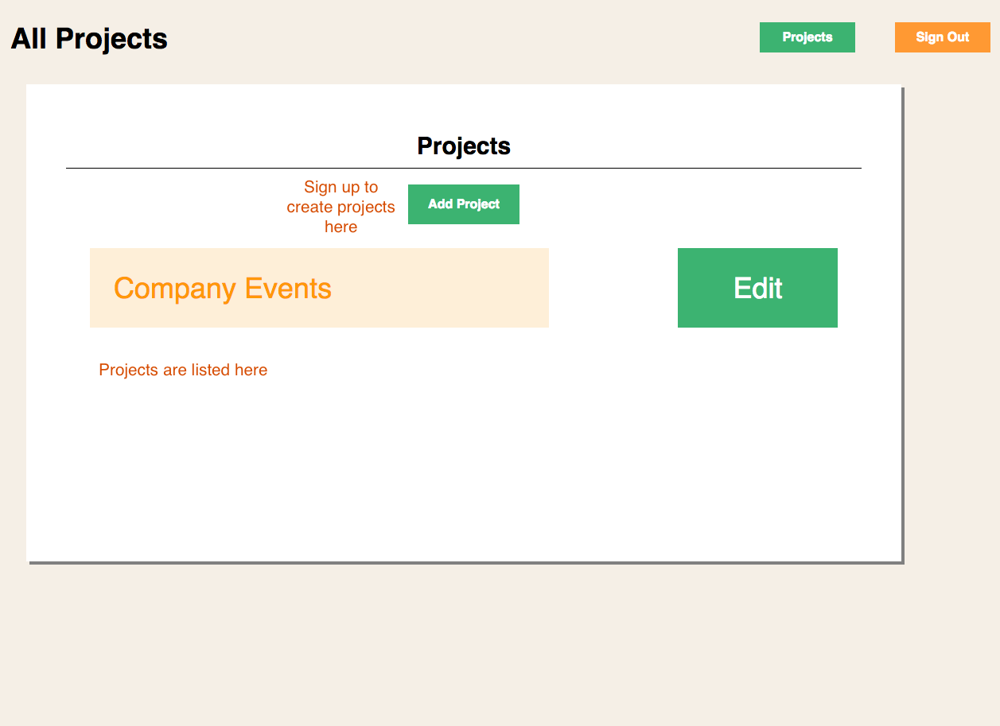
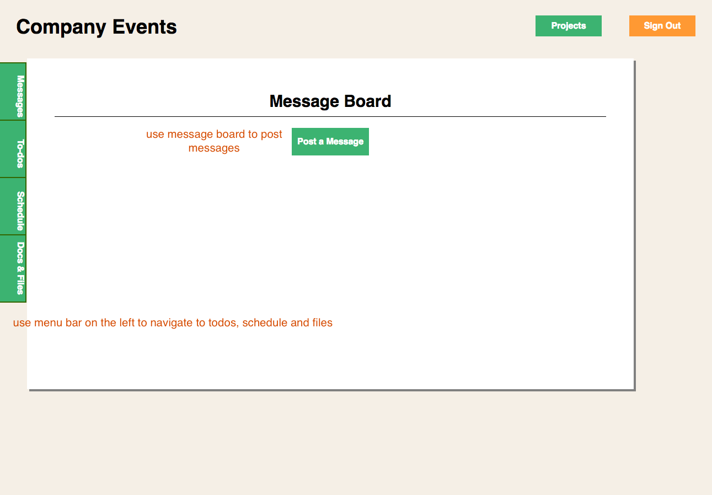
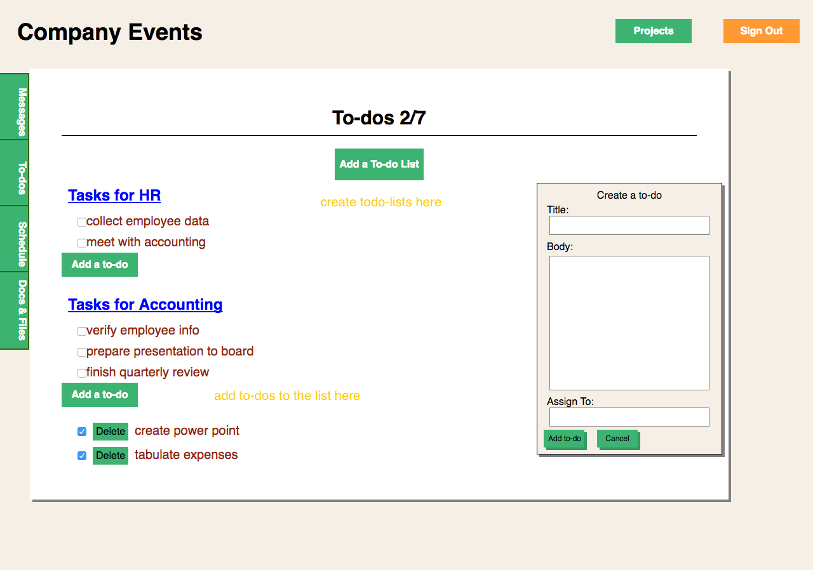

Base Page is a inspired of a popular work organizer app, basecamp.com.
The app includes message boards, todo-list, calenders, file uploads.

Base Page is a single page web-app built with a react front end and rails backend.

##Projects
Users create projects on the project index page.

  

##Messages
The message board is where communication happens between team members.

##To-dos
To-do lists and to-dos can be created here.

Others features include a calender to post events, and an uploads page to share
files.

##Future additions
- Notifications
- Live Chat
- Streaming video
